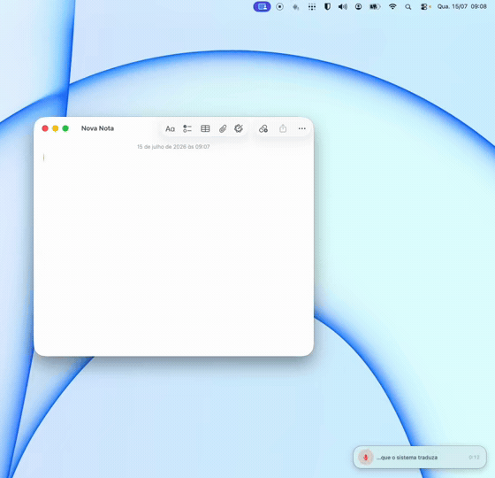

# Spit — Voice Dictation for macOS

Free, open-source, 100% on-device voice dictation for Mac. No subscription, no cloud, no API keys.


[](https://github.com/Draxo-io/spit/releases/latest)
[](https://github.com/Draxo-io/spit/stargazers)



*Real-time demo: dictating in **Portuguese** (live preview in the pill, bottom right) — Spit transcribes and translates on-device, and types the text in **English** into Notes.*

---

## Features

- **Hotkey dictation** — tap the Globe key (🌐) to start/stop, or hold for push-to-talk
- **On-device Whisper** — transcription via [WhisperKit](https://github.com/argmaxinc/WhisperKit), runs entirely on your Mac
- **Live preview** — see words appear in real time via `SFSpeechRecognizer` while recording
- **Text injection** — inserts transcribed text directly into any app via the Accessibility API (no clipboard pollution)
- **Media pause** — automatically pauses Spotify, Apple Music, and web players during dictation
- **Text formatting** — on-device LLM cleans up punctuation and paragraph breaks
- **TTS (read selection)** — press the hotkey with text selected to have it read aloud via `AVSpeechSynthesizer`
- **Vocabulary manager** — personal word substitutions and prompt hints for domain-specific terms
- **Auto-translate** — post-transcription translation via macOS 15+ on-device Translation API

## Requirements

- macOS 14.0 (Sonoma) or later
- Apple Silicon (M1 or newer) — required for on-device Whisper inference

## Installation

### Download (recommended)

Download the latest release from the [Releases](https://github.com/Draxo-io/spit/releases) page and drag Spit.app to your Applications folder.

### Build from source

```bash
git clone https://github.com/Draxo-io/spit.git
cd spit

# Build
xcodebuild \
  -project VoiceFlow.xcodeproj \
  -scheme VoiceFlow \
  -configuration Release \
  -destination 'platform=macOS' \
  build

# Find the built app
open ~/Library/Developer/Xcode/DerivedData/VoiceFlow-*/Build/Products/Release/Spit.app
```

Xcode 15+ is required. No other dependencies needed — the project uses only the Apple SDK and WhisperKit (fetched via Swift Package Manager).

## How it works

1. **Hotkey** — a global `CGEventTap` on the Globe key captures the trigger anywhere on macOS
2. **Record** — `AVAudioEngine` captures microphone audio; `SFSpeechRecognizer` streams a live word preview
3. **Transcribe** — on key release, the audio buffer is passed to WhisperKit for on-device inference
4. **Inject** — the transcribed text is inserted at the cursor position using the macOS Accessibility API (`AXUIElement`), with a clipboard fallback (⌘V) for apps that don't support AX insertion

Everything happens on your device. No network requests are made during normal operation.

## Privacy

Spit is designed to be privacy-first by default:

- All audio is processed locally using on-device Whisper models (via WhisperKit)
- No audio is ever transmitted to external servers
- No account, email, or personal information is required
- App Sandbox is always enabled with minimal entitlements (microphone + Accessibility)
- No analytics, no telemetry, no tracking

## Contributing

Contributions are welcome — see [CONTRIBUTING.md](CONTRIBUTING.md).

Found a security issue? See [SECURITY.md](SECURITY.md) — please don't open a public issue.

## License

MIT — see [LICENSE](LICENSE) for the full text.

## Acknowledgments

- [WhisperKit](https://github.com/argmaxinc/WhisperKit) by Argmax — on-device Whisper inference for Apple Silicon
- [OpenAI Whisper](https://github.com/openai/whisper) — the underlying speech recognition models

---

Built by [Rafael Lopes](https://getspit.app/about) at [Draxo.io](https://draxo.io) — a solo indie studio, no investors, no sales team.

*Built with care in the EU.*
